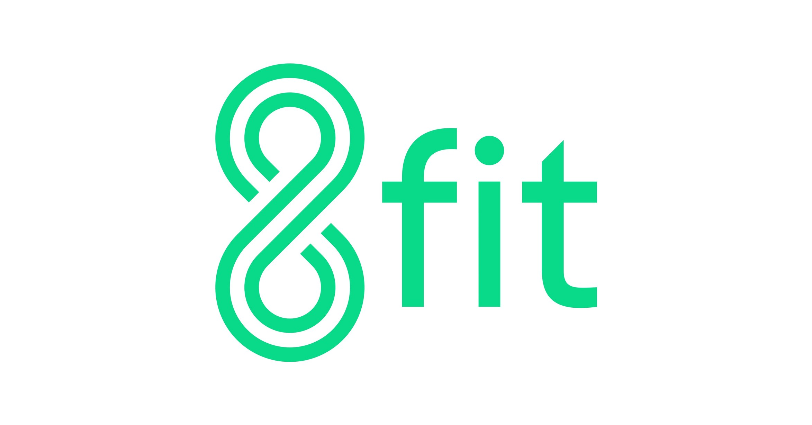

# 8fit
## Data Science assignment

### Tech used
Python:
 - Numpy and Pandas libraries for data exploration
 - Matplotlib for data visualization
 - Scikit for machine learning

### Methodology

The methodoloy can be divided into two parts:

1. Data exploration and visualization
I started by loading the data set and exploring the different features with numpy and Pandas. Then, I moved to some data visualization in order to get some insights and a better grasp of the dataset.

2. Data cleaning and Machine Learning (prediction)
The data cleaning consists of getting rid of all the columns that are not numerical after transforming them into dummies columns. The user_id column was also removed as it contains irrelevant information for the prediction. Last step of data cleaning consists of dividing the the dataset into a training set (on which we will fit a model) and cross-validation set where we will test our model.

Once the data is cleaned, two models have been fit to it: a logistic regression model and a random forest model.

### Results

A gridsearch on different hyper-parameters was applied for each of the model in order to consider various hyper-parameters and select the ones that outcome the best accuracy. Basically, all hyper-parameters combinations gave the same accuracy. The logistic model outperformed the random forest model by 4% for a final accuracy of 70%. It is worth noting that 70% of the customer have a 0 value so predicting every customer with 0 would lead to the same accuracy result. Therefore a better metric is the F score that takes into account both false negatives and false positives.

### Next steps

As the prediction results are not great, I would recommend the following steps (in order of importance):
 1. Collecting new features
 2. Features engineering
 3. Collect more data

Deep learning (neural networks) with for instance TensorFlow could also lead to better results but I would first recommend the aforementionned steps.